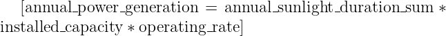

<a id="readme-top"></a>

# Japan Meteorological Agency Solar Power Analysis Project


[](https://www.linkedin.com/in/daeunjin/)


<!-- TABLE OF CONTENTS -->
<details>
  <summary>Table of Contents</summary>
  <ol>
    <li>
      <a href="#about-the-project">About The Project</a>
      <ul>
        <li><a href="#built-with">Built With</a></li>
        <ul>
          <li><a href="#Python-Library">Python Library</a></li>
        </ul>
      </ul>
    </li>
    <li>
      <a href="#getting-started">Getting Started</a>
      <ul>
        <li><a href="#installation">Installation</a></li>
        <li><a href="#Sample-Data-and-Web-Scraping-Caution">Sample Data and Web Scraping Caution</a></li>
        <li><a href="#Example-Output-Using-Sample-Data">Example Output Using Sample Data</a></li>
      </ul>
    </li>
    <li>
      <a href="#usage">Usage</a>
      <ul>
        <li><a href="#Code-Overview">Code Overview</a></li>
        <li><a href="#Variables-and-Assumptions">Variables and Assumptions</a></li>
        <ul>
          <li><a href="#Default-Assumed-Values">Default Assumed Values</a></li>
        </ul>
        <li><a href="#Formula-Descriptions">Formula Descriptions</a></li>
      </ul>
    </li>
    <li><a href="#Papers-and-References">Papers and References</a></li>
    <li><a href="#contributing">Contributing</a></li>
    <li><a href="#license">License</a></li>
    <li><a href="#contact">Contact</a></li>
    <li><a href="#Acknowledgments">Acknowledgments</a></li>
  </ol>
</details>


<!-- ABOUT THE PROJECT -->
## About The Project
This Python script downloads, processes, and analyzes sunlight duration data from the Japan Meteorological Agency's website. Based on the sunlight data, it calculates the annual power generation, income, and surface profit that can be obtained by installing solar panels and visualizes various aspects of the data through graphs.


<p align="right">(<a href="#readme-top">back to top</a>)</p>


### Built With

[![Python][Python.js]][Python-url]
![Visual Studio Code][Visual Studio Code.js]

#### Python Library

![Requests][Requests.js]
![Pandas][Pandas.js]
![Matplotlib][Matplotlib.js]
![Chardet][Chardet.js]


<p align="right">(<a href="#readme-top">back to top</a>)</p>


<!-- GETTING STARTED -->
## Getting Started


### Installation

>#### Prerequisites
  Python 3.11.4

  
  Library: Requests, Pandas, Matplotlib, Chardet

  ***


1. Open the terminal and run the following command to install the necessary libraries:
   ```bash
   pip install requests pandas matplotlib chardet
   ```

    This command installs the following libraries:
    - `requests`: A library for handling HTTP requests
    - `pandas`: A library for data analysis and manipulation
    - `matplotlib`: A library for data visualization
    - `chardet`: A library for character encoding detection

2. [Download](Solar_Data_Analysis_Tool.py) the Solar_Data_Analysis_Tool.py file to your local computer.
   
4. Open a terminal and navigate to the directory where the file is saved.
   
6. Run the following command to execute the script:
   ```bash
   python Solar_Data_Analysis_Tool.py
   ```


<p align="right">(<a href="#readme-top">back to top</a>)</p>


### Sample Data and Web Scraping Caution

Due to the potential legal and ethical issues of web scraping, a sample CSV file is provided for you to test and understand the functionality of the program. To use the sample data, follow these steps:

1. Download the `data_sample.csv` from [this location](data_sample.csv).
2. Place it in the same directory as the program.
3. Run the program as described in the [Installation](#Installation) section.

Please ensure you are in compliance with the terms of use of the website if you intend to use the web scraping feature.


<p align="right">(<a href="#readme-top">back to top</a>)</p>


### Example Output Using Sample Data

#### Expected Outputs
Using the provided sample CSV file, the program will show the following outputs:

```bash
1 Year - Total power generation: 144193.0 kWh 
1 Year - Expected income: 2307088.0 円
1 Year - Surface Profit: 9.228 %
```

1. Total solar power generation for one year
2. Expected income for one year
3. Surface profit rate for one year


#### Graphical Outputs

Along with text-based results, the program also generates graphs.

1. Daily Average Sunlight Duration: This graph shows the daily average duration of sunlight. It can be seen that the duration varies.
2. Monthly Total Sunlight Duration: This graph shows the total duration of sunlight for each month, allowing for easy understanding of sunlight duration in each month. 
3. Sunlight Duration Distribution: This histogram shows the distribution of sunlight durations. Most durations are close to 0, with very few outliers.
4. Monthly Average Sunlight Duration: This graph shows the average duration of sunlight per month, allowing for easy understanding of monthly variations.

> **Note**: You may see related warning messages while plotting the graphs. These are generally safe to ignore.

#### Sample Data Information

The sample data for this project is based on the sunlight duration data in Yokohama city from April 1, 2022, to March 31, 2023, provided by the Japan Meteorological Agency. This time frame is recommended for assessing annual solar power generation as it captures the variability across all four seasons in Japan and minimizes the impact of typhoon seasons on solar output.


<p align="right">(<a href="#readme-top">back to top</a>)</p>


## Usage

### Code Overview
This Python code aims to download and analyze solar power data from the Japan Meteorological Agency's website. The code consists of three main steps: data download, analysis, and visualization.


<p align="right">(<a href="#readme-top">back to top</a>)</p>


### Variables and Assumptions

#### Variables

- `installed_capacity`: Installed solar panel capacity in (kW)
- `operating_rate`: The percentage of actual power output compared to the maximum possible output in percentage (%)
- `efficiency_coefficient`: Coefficient indicating the efficiency of the solar panel
- `trading_price`: Trading price of solar power in yen (円)
- `initial_investment`: Initial investment amount in yen (円)
- `df_1_year`: Dataframe containing data for one year
- `monthly_avg_sunlight`: Monthly average sunlight duration
- `daily_avg_sunlight`: Daily average sunlight duration
- `monthly_total_sunlight`: Monthly total sunlight duration
- `total_power_generation_1_year`: Total power generation in one year in kWh
- `expected_income_1_year`: Expected income in one year in yen (円)
- `surface_profit_1_year`: Surface profit rate in one year in percentage (%)

#### Default Assumed Values

| Variable               | Default Value | Notes                         |
|------------------------|---------------|-------------------------------|
| `installed_capacity`   | 100 kW       |                               |
| `operating_rate`       | 1 (100%)      | Assumes full operation during sunlight hours |
| `efficiency_coefficient` | 0.7         | [Based on papers](#efficiency-coefficient-reference) |
| `trading_price`        | 16円          | [Based on Economic Industry site](#Trading-Price-Reference)  |
| `initial_investment`   | 25.0万円/kW    | [Based on Economic Industry site](#Initial-Investment-Reference)  |

<p align="right">(<a href="#readme-top">back to top</a>)</p>


### Formula Descriptions

1. **Total Power Generation Calculation**:  
   - This formula calculates the total power generated in a year.

   

   <details>
     <summary>About this formula</summary>

     1. **Original Total Power Generation Calculation**: [Based on papers](#Total-Power-Generation-Calculation)
        
        

     2. **Efficiency Coefficient**: However, the formula may not account for various factors such as equipment aging, weather conditions, or technological efficiency. To improve accuracy, we introduce an "Efficiency Coefficient". In this formula, the value is set to 0.7. [Based on papers](#efficiency-coefficient-reference)

        

   </details>

2. **Expected Income Calculation**:  
   - This formula calculates the expected income in a year based on the total power generated and the trading price.

   

3. **Surface Profit Rate Calculation**:  
   - This formula calculates the profit rate as a percentage of the initial investment.

   

<p align="right">(<a href="#readme-top">back to top</a>)</p>


### Papers and References

- <a id="Total-Power-Generation-Calculation"></a>Total Power Generation Calculation Formula Reference: Yeonju, A., Taekkie, L., & Kyuho, k. (2021). *Prediction of Photovoltaic Power Generation Based on LSTM Considering Daylight and Solar Radiation Data*. Journal of Electrical Engineering Association, p.1098. [Retrieved from KCI](https://www.kci.go.kr/kciportal/ci/sereArticleSearch/ciSereArtiView.kci?sereArticleSearchBean.artiId=ART002742867)
- <a id="efficiency-coefficient-reference"></a>Efficiency Coefficient Reference: Seongcheol, Kim. (2018). *A study on natural condition variables applied calculation equation of prediction power generation amount for efficient usage of photovoltaic system* (Master's thesis). University of Yonsei, p. 15. [Retrieved from RISS](http://www.riss.kr/search/detail/DetailView.do?p_mat_type=be54d9b8bc7cdb09&control_no=9327f1bbf8e1e678ffe0bdc3ef48d419&outLink=K)
- <a id="Trading-Price-Reference"></a>Trading Price Reference: [Economic Industry Site](https://www.meti.go.jp/press/2022/03/20230324004/20230324004.html)
- <a id="Initial-Investment-Reference"></a>Initial Investment Reference: [Economic Industry Site](https://www.meti.go.jp/shingikai/santeii/pdf/073_01_00.pdf), p.25


<p align="right">(<a href="#readme-top">back to top</a>)</p>


## Contributing

We encourage community involvement and contributions. If you would like to contribute, please follow these steps:

1. **Fork the Project** - Fork the project repository to your own GitHub account.
2. **Clone the Repository** - Clone the forked repository to your local machine.
3. **Create a New Branch** - Create a new branch for your changes.
4. **Make Changes** - Add or change the code in this branch.
5. **Commit Changes** - Commit your changes with an appropriate message.
6. **Open a Pull Request** - Open a pull request from your forked repository to the project repository.

For more detailed information, please read our [Contribution Guide](CONTRIBUTING.md).

<p align="right">(<a href="#readme-top">back to top</a>)</p>


## License

This project is licensed under the MIT License - see the [LICENSE.md](LICENSE.md) file for details.

<p align="right">(<a href="#readme-top">back to top</a>)</p>

## Contact

For any inquiries, issues, or contributions, please contact:

DAEUN JIN - dianajin0123@gmail.com

Project Link: [Solar Power Analysis Project](https://github.com/dianajin0123/JIN2/tree/main)

<p align="right">(<a href="#readme-top">back to top</a>)</p>

## Acknowledgments

We would like to extend our gratitude to:

1. **Japan Meteorological Agency** - For providing the invaluable data used in this project.
2. **Contributors** - For their dedication and hard work in the development of this project.
3. **Open Source Community** - For providing the libraries and tools that made this project possible.

For a full list of papers and references that contributed to this work, please refer to the ["Papers and References"](#Papers-and-References) section.

<p align="right">(<a href="#readme-top">back to top</a>)</p>


 <!-- MARKDOWN LINKS & IMAGES -->

[Python.js]: https://img.shields.io/badge/python-3670A0?style=for-the-badge&logo=python&logoColor=ffdd54
[Python-url]: https://www.python.org
[Visual Studio Code.js]: https://img.shields.io/badge/Visual%20Studio%20Code-0078d7.svg?style=for-the-badge&logo=visual-studio-code&logoColor=white
[Requests.js]: https://img.shields.io/badge/Requests-FFFF00?logoColor=white
[Pandas.js]: https://img.shields.io/badge/Pandas-000000?logoColor=white
[Matplotlib.js]: https://img.shields.io/badge/Matplotlib-00008B?logoColor=white
[Chardet.js]: https://img.shields.io/badge/Chardet-006400?logoColor=white
[IO.js]: https://img.shields.io/badge/IO-483D8B?logoColor=white


